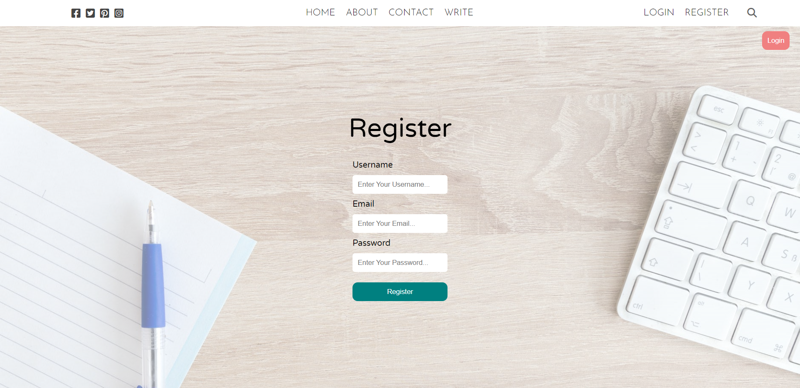

# React Blog Website


Welcome to the React Blog website! This is a front-end-only blog platform built using React. It provides features such as post creation, profile settings, and viewing posts created by other users. This README will guide you through the project and provide instructions for setup and usage.

## Table of Contents

- [Introduction](#react-blog-website)
- [Features](#features)
- [Screenshot](#screenshot)
- [Installation](#installation)
- [Usage](#usage)

## Features

- **Home Page:** Displays a list of recent posts with titles and excerpts.
  
- **Login Page:** Allows users to log in to their accounts.
  
- **Register Page:** Provides new users with a registration form.
  
- **Post Create Page:** Allows users to create new blog posts.
  
- **Profile Settings Page:** Enables users to update their profile information.
  
- **Post Page:** Displays the full content of a selected post created by a user.
  

## Installation

1. Clone the repository using the following command:

   ```bash
   git clone https://github.com/sadanmian/React-Blog.git
   ```

2. Navigate to the project directory:

   ```bash
   cd React-Blog
   ```

3. Install the required dependencies:

   ```bash
   npm install
   ```

## Usage

1. Start the development server:

   ```bash
   npm start
   ```

   This will launch the website in your default web browser. You can access it at `http://localhost:3000`.

2. Navigate through the website using the provided navigation links.

3. Register a new account or log in with an existing account to start creating posts and exploring the features.

## Contributing

Contributions are welcome! If you'd like to contribute to this project, please follow these steps:

1. Fork the repository.
2. Create a new branch for your feature or bug fix.
3. Make your changes and test them thoroughly.
4. Commit your changes with clear and concise commit messages.
5. Push your changes to your forked repository.
6. Create a pull request explaining your changes and their purpose.
